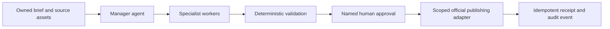

<p align="center">
  <a href="https://edgeagent.github.io/content-agent-operating-system/">
    
  </a>
</p>

<h1 align="center">Content Agent Operating System</h1>

<p align="center">
  A public operating manual for content teams that want automation to remain <strong>useful, inspectable, and accountable</strong>.
</p>

<p align="center">
  <a href="https://edgeagent.github.io/content-agent-operating-system/"></a>
  <a href="https://edgeagent.github.io/content-agent-operating-system/#/features"></a>
  <a href="https://edgeagent.github.io/content-agent-operating-system/#/project"></a>
  <a href="docs/architecture.md"></a>
</p>

<p align="center">
  <a href="https://github.com/EdgeAgent/content-agent-operating-system/actions"></a>
  
  
</p>

<p align="center">
  <a href="https://edgeagent.github.io/content-agent-operating-system/">
    
  </a>
</p>

> **Draft freely. Validate deterministically. Approve explicitly. Publish deliberately.**

The **Content Agent Operating System** is a public field guide for teams designing content workflows that can do real work without becoming an opaque, unattended publishing machine. It models every job as a small, controlled chain: an accountable manager routes it, specialists return narrow artifacts, deterministic controls validate its state, a named person approves the exact final artifact, and an official adapter publishes once with a receipt.

## Start here

| Destination | What it gives you |
| --- | --- |
| [**Live operating guide**](https://edgeagent.github.io/content-agent-operating-system/) | The complete visual field manual, including the work graph, authority model, and economics comparison. |
| [**Feature guide**](https://edgeagent.github.io/content-agent-operating-system/#/features) | A practical explanation of controls, the orchestration loop, rollout gates, and campaign-ready use. |
| [**Project profile**](https://edgeagent.github.io/content-agent-operating-system/#/project) | The project’s operating position, reference scope, core principles, and non-negotiable constraints. |
| [**Architecture notes**](docs/architecture.md) | A compact technical reference for implementing the control model. |

## The work graph



<p align="center">
  
  
</p>

## Roles and authority

| Role | Core responsibility | Authority boundary |
| --- | --- | --- |
| **Manager** | Routes the next constrained action and selects allowlisted workers. | Cannot self-approve, invent tools, or publish from informal instructions. |
| **Specialists** | Return research, writing, edit-plan, and QA artifacts. | Cannot alter policy or advance unvalidated work. |
| **Deterministic controls** | Verify schema, state, rights, budget, duplicate uploads, and evidence. | Cannot make editorial or authority judgments. |
| **Approver + official adapter** | Authorize one artifact and make one scoped platform action. | Cannot silently retry or approve a changed artifact. |

## What a controlled job does

1. **Loads the job** with its brief, rights, policy version, budget, and current state.
2. **Produces one manager next action** that names the target state, worker or tool, required evidence, and risks.
3. **Checks policy and schema** before a worker runs.
4. **Creates or validates one bounded artifact.**
5. **Requires named approval** for the exact final artifact hash.
6. **Publishes once** with a scoped official adapter, an idempotency key, and a recorded receipt.

## A 30-day adoption sequence

| Window | Focus | Evidence gate |
| --- | --- | --- |
| **Days 01–03** | Foundation | Source ownership, consent, rights, brand voice, and a versioned playbook. |
| **Days 04–07** | Drafting | Structured intake, source cards, drafts, variants, and a human review packet. |
| **Days 08–14** | Controls | State machine, schema checks, idempotency, budgets, and pass/fail gates. |
| **Days 15–21** | Production | Technical QA, subtitles, approval packets, and artifact-hash match. |
| **Days 22–30** | Publication | One official adapter, public receipt, labeled analytics, and a pause procedure. |

## Run locally

```bash
pnpm install
pnpm dev
pnpm check
pnpm build
```

The source site lives on `main`. The static public build is served from the `gh-pages` branch at the [live GitHub Pages guide](https://edgeagent.github.io/content-agent-operating-system/).

## Scope

This repository is grounded in the supplied *Content Agent Operating System* PDF. Its directional token figures are illustrative and do not include rendering, storage, data transfer, platform APIs, human review, or incident handling. The project is an operating-model reference; it does not replace legal, platform, or rights review.
