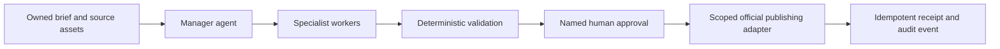

<p align="center">
  
</p>

<h1 align="center">Content Agent Operating System</h1>

<p align="center">
  <strong>An open repository for building controlled, evidence-driven content operations.</strong>
</p>

<p align="center">
  <a href="docs/architecture.md"></a>
  <a href="#repository-map"></a>
  <a href="../../tree/media"></a>
  <a href="#run-locally"></a>
</p>

<p align="center">
  
  
  
  
</p>

<p align="center">
  
</p>

> **Draft freely. Validate deterministically. Approve explicitly. Publish deliberately.**

The **Content Agent Operating System** is a repository and reference implementation for teams that want content automation to remain useful without becoming opaque or unattended. It models every job as a small, controlled chain: an accountable manager routes the work, specialists return narrow artifacts, deterministic checks validate state, a named owner approves the exact final artifact, and a scoped adapter carries out one auditable action.

## Why this repository exists

Most content automation discussions stop at prompting or model selection. This project starts with the operational system around the model: source ownership, role separation, hard validation gates, explicit approval, idempotency, and an audit record. The goal is not artificial autonomy; it is **traceable completion**.

## Repository map

| Area | What it contains | Start here |
| --- | --- | --- |
| [`client/`](client/) | The React interface that turns the operating model into an editorial reference experience. | [`client/src/pages/Home.tsx`](client/src/pages/Home.tsx) |
| [`docs/`](docs/) | The source-grounded architecture guide, control loop, roles, rollout sequence, and economics notes. | [`docs/architecture.md`](docs/architecture.md) |
| [`media`](../../tree/media) branch | Repository-hosted visual assets used by this project’s documentation and presentation. | [View the media collection](../../tree/media) |
| [`ideas.md`](ideas.md) | The design system and brand rules behind the “Operative Ledger” presentation. | [Read the design direction](ideas.md) |

## The work graph



<p align="center">
  
  
</p>

## Authority at a glance

| Role | Responsible for | Must not do |
| --- | --- | --- |
| **Manager** | Route the next constrained action and select allowlisted workers. | Self-approve, invent tools, or publish from informal instructions. |
| **Specialists** | Return research, writing, edit-plan, and QA artifacts. | Alter policy or advance unvalidated work. |
| **Deterministic controls** | Verify schema, state, rights, budget, duplicate uploads, and evidence. | Make editorial or authority judgments. |
| **Approver + scoped adapter** | Approve one artifact and make one defined platform action. | Silently retry or approve a changed artifact. |

## A controlled job, step by step

1. **Load the job** with the brief, rights, policy version, budget, and current state.
2. **Produce one manager next action** naming the target state, worker/tool, required validations, and risks.
3. **Validate the policy and schema** before any worker runs.
4. **Create or validate one bounded artifact.**
5. **Require named approval** for the exact final artifact hash.
6. **Record the action** with an idempotency key, receipt, and audit event.

## 30-day adoption sequence

| Window | Focus | Evidence gate |
| --- | --- | --- |
| **Days 01–03** | Foundation | Source ownership, consent, rights, brand voice, and a versioned playbook. |
| **Days 04–07** | Drafting | Structured intake, source cards, drafts, variants, and a human review packet. |
| **Days 08–14** | Controls | State machine, schema checks, idempotency, budgets, and pass/fail gates. |
| **Days 15–21** | Production | Technical QA, subtitles, approval packets, and artifact-hash match. |
| **Days 22–30** | Publication | One official adapter, receipt, labeled analytics, and a pause procedure. |

## Run locally

```bash
pnpm install
pnpm dev
pnpm check
pnpm build
```

## Scope

This repository is grounded in the supplied *Content Agent Operating System* PDF. The directional token figures in the reference materials are illustrative and do not include rendering, storage, data transfer, platform APIs, human review, or incident handling. The project is an operating-model resource, not legal, platform, or rights advice.
