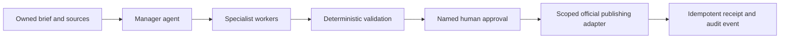

# Content Agent Operating System

> **A public field guide for controlled, evidence-driven content operations.**

The **Content Agent Operating System** translates the supplied architecture brief into an open, navigable reference and GitHub Pages project. It presents a content-production system as a controlled work graph: an accountable manager routes one job, specialists return bounded artifacts, deterministic checks validate state, a named person approves an exact artifact, and an official adapter publishes once with a receipt.

## Project pages

| Page | Purpose |
| --- | --- |
| **Overview** | Explains the operating position, architecture, role separation, directional economics, and proof standard. |
| **Feature guide** | Breaks down the control model, one bounded orchestration loop, 30-day rollout, and campaign-ready use pattern. |
| **Project profile** | Documents the operating position, source basis, core principles, and non-negotiable constraints. |

## Core architecture



| Role | Does | Does not |
| --- | --- | --- |
| **Manager** | Routes the next constrained action, selects allowlisted workers, and requests review | Self-approve, invent tools, or publish from casual instruction |
| **Specialists** | Produce research, drafts, edit plans, and QA artifacts | Alter policy or advance the job without validation |
| **Deterministic controls** | Verify schema, state, rights, cost, duplicate uploads, and evidence | Make editorial or authority judgments |
| **Approver + official adapter** | Approve an exact artifact and make one scoped platform action | Silently retry or approve a changed artifact |

## The control loop

The system executes one bounded iteration at a time:

1. Load the job with its brief, rights, policy, budget, and current state.
2. Have the manager produce one structured next action.
3. Verify the action against policy and schema constraints.
4. Create or validate one bounded artifact.
5. Require named approval for the exact final artifact hash.
6. Publish through one official adapter with an idempotency key and record the receipt.

## Development

This is a React 19 and Vite static site. It uses hash-based routes so that deep links work reliably in a GitHub Pages deployment.

```bash
pnpm install
pnpm dev
pnpm check
pnpm build
```

For the public release, the compiled static bundle is published to the repository’s `gh-pages` branch. The source stays on `main`; GitHub Pages serves the generated output directly from that public branch.

## Source material and scope

The site and documentation are grounded in the user-supplied *Content Agent Operating System* PDF. The directional token figures are illustrative and exclude media rendering, storage, data transfer, official platform APIs, human review, and incident handling. This project is a design and operating-model reference, not legal, platform, or rights advice.

For the fuller written summary, see [docs/architecture.md](docs/architecture.md).
