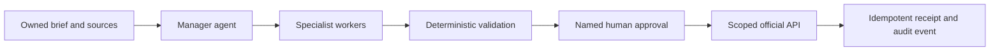

# Content Agent Operating System

> **Draft freely. Validate deterministically. Approve explicitly. Publish deliberately.**

The Content Agent Operating System is a controlled workflow for one bounded content job at a time. It does not propose a single autonomous publisher. Instead, it separates routing, artifact creation, validation, approval, and public action so that every state transition is inspectable.

## Architecture at a glance

## Roles and authority

| Role | Core responsibility | Authority boundary |
| --- | --- | --- |
| Manager | Routes the next bounded action | Cannot self-approve, invent tools, or publish from informal instructions |
| Specialists | Return research, drafts, edit plans, and QA artifacts | Cannot alter policy or advance unvalidated work |
| Deterministic controls | Verify schemas, rights, budgets, duplicate uploads, and state | Cannot make editorial or authority judgments |
| Approver + adapter | Authorize one artifact and make one scoped platform action | Cannot silently retry or approve a changed artifact |

## The orchestration loop

1. **Load job** with brief, owned asset IDs, rights, policy version, budget, and state.
2. **Produce one manager next action** naming the target state, worker/tool, inputs, validations, and risks.
3. **Validate policy and schema** before a worker is called.
4. **Create or validate one bounded artifact.**
5. **Require named approval** for the exact final artifact hash.
6. **Publish once** with a scoped official adapter and idempotency key; persist the receipt and audit event.

## Rollout sequence

| Days | Phase | Primary proof |
| --- | --- | --- |
| 01–03 | Foundation | Source ownership, consent, rights, brand voice, and a playbook |
| 04–07 | Drafting | Structured intake, source cards, drafts, variants, and review packets |
| 08–14 | Controls | State machine, schema checks, idempotency, cost limits, and pass/fail gates |
| 15–21 | Production | Technical QA, subtitles, approval packets, and artifact-hash match |
| 22–30 | Publication | One official adapter, receipt, labeled analytics, and a pause procedure |

## Economics note

The source document uses an illustrative baseline of one content job per day for 30 days, with 60K input tokens and 18K output tokens per job across 12 model calls. That yields 1.80M input and 0.54M output tokens per month. The directional token comparison in the source excludes media rendering, storage, data transfer, platform APIs, human review, and incident handling.

## Source

This documentation is a faithful public summary of the supplied **Content Agent Operating System** PDF. It is not a substitute for legal, platform, or rights review.
